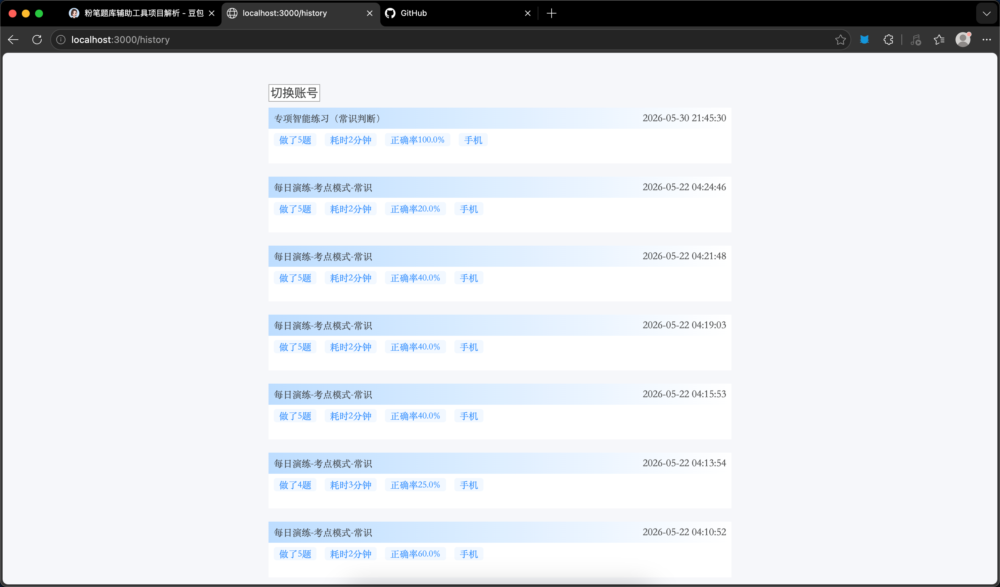
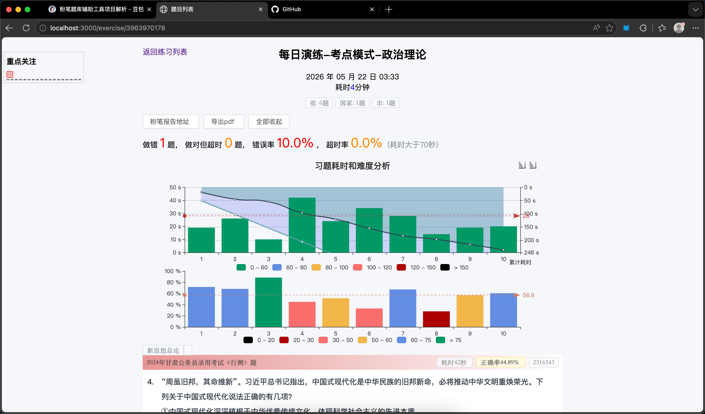
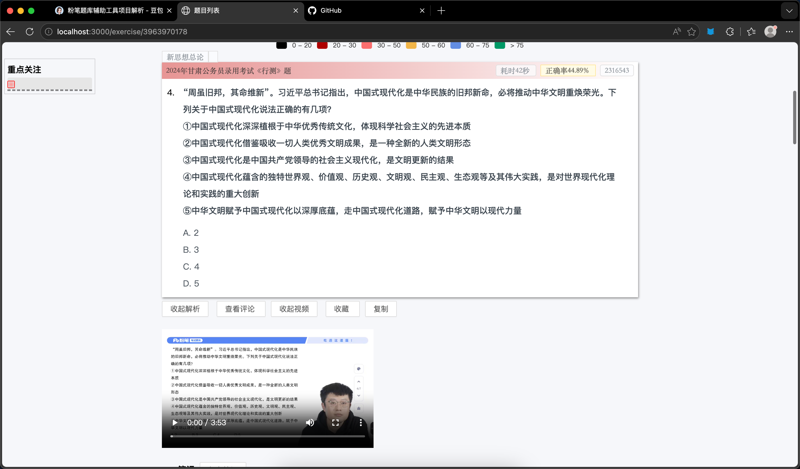
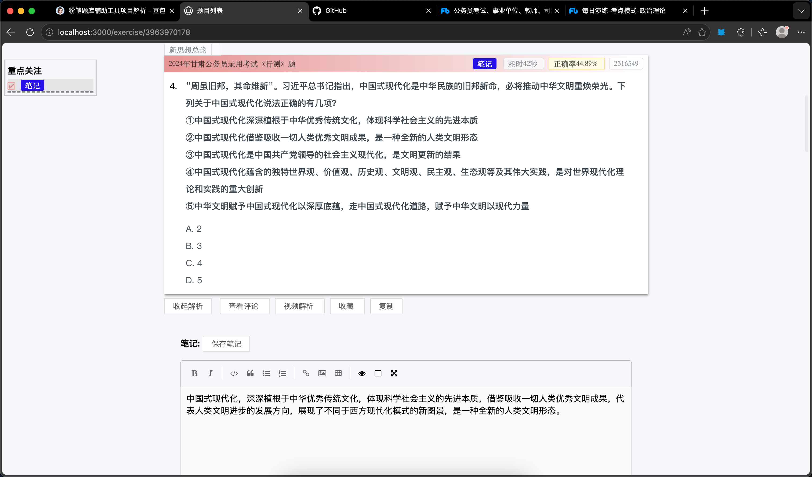
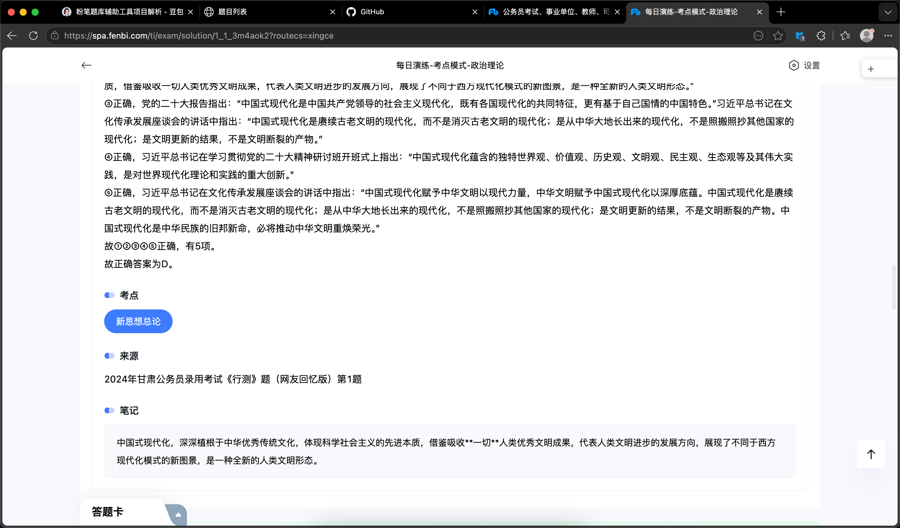

# 粉笔题库辅助工具|开源文档

## 项目简介

fenbi-helper 基于 2020 年 GitHub 开源粉笔辅助项目二次迭代改造。

**主要优化内容：**

- **登录逻辑修改**：适配粉笔最新登录流程，重构鉴权规则
- **接口边界值规范调整**：统一参数校验、补齐异常兜底，增强接口稳定性

本地 Node + 前端 Web 服务，无需客户端，浏览器访问 `localhost:3000` 即可使用；
仅需填入个人粉笔账号密码登录，自动同步用户刷题数据，实现刷题统计、错题复盘、题目导出、耗时分析全链路功能。

## ✨ 核心功能

### 刷题历史汇总页（/history）



1. 自动拉取账号全部练习记录，展示练习名称、做题数量、耗时、正确率、设备来源；
2. 按练习时间倒序排版，支持切换多粉笔账号查看不同备考数据。

### 单次练习详情 & 数据分析页



1. 汇总本次练习：总错题数、正确率、超时率（自定义＞70s 为超时）、题目来源（省考/国考分类）；
2. 双图表可视化：单题耗时分布柱状图、题目难度正确率统计图；
3. 支持一键导出 PDF 试卷、跳转粉笔原题报告。

### 单题详情 + 笔记模块





1. 完整展示原题、选项、官方解析、用户评论，附带粉笔视频解析快捷入口；
2. 内置富文本笔记编辑器，笔记支持本地持久存储，同时可一键同步至粉笔平台原题笔记栏；
3. 题目收藏双向互通，本地收藏与粉笔我的收藏可互相同步，搭配文本复制快捷操作；
4. 本地与粉笔两端收藏、笔记数据互通，便于蒙对的题进行整理、考前复盘背诵。

## 🛠 部署教程（macOS/Linux/Windows 通用）

### 环境依赖

- Node.js ≥16 LTS
- Git

```bash
# 克隆项目
git clone https://gitee.com/MythicalCreature/fenbi-helper-master.git
cd fenbi-helper-master

# 安装依赖
npm install

# 启动服务
# 方式1（优先，读取package.json配置）
npm start

# 方式2 直接跑入口文件
node src/app.js
```
